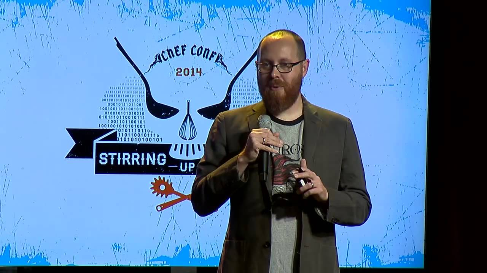

## what do you want to be  

# when you _grow up_

###   @scottsbaldwin

---

# adults 
## and their imaginations

### **kids _think_ differently**

^ Adults want you to say things like: doctor, lawyer, astronaut, scientist
Kids think things like rock star, pro athlete

---

---

## [fit] i just want to be
# [fit] _happy_

^ Logan LaPlante
https://www.youtube.com/watch?v=h11u3vtcpaY

---

> [We] are endowed by [our] Creator with certain unalienable Rights ... Life, Liberty and the pursuit of Happiness.
-- Thomas Jefferson

---

## happy people

<!--
+ make good friends
+ actively pursue goals
+ do what you excel at as often as you can
-->

### actively express _thank_fulness
### live the life _they_ want to live
### don't chase _stuff_
### _give_

^ http://www.inc.com/jeff-haden/7-things-remarkably-happy-people-do-more.html
"Things" only provide momentary bursts of happiness. To be happier, don't chase as many things. Chase a few experiences intead.

---

> Happiness is not a goal...
> it's a by-product of a life well lived.
-- Eleanor Roosevelt

---

###   our needs  

---

## are you feeling

# _well chuffed!_

### bit.ly/wellchuffed

---

## track _happiness_ (ditch velocity)

### bit.ly/wellchuffed

---

## @adamhjk

### we spend 8+ hours
### working each day--
### more time than with the 
### _**people we love the most!**_

---

## do you need a change?

###_Happiness_ is fleeting
###_Contentment_ is long-lasting

---

### you and i need

# **3 _positive_ emotions**

### to balance **1** negative

- _flourish_ at 11:1
- languish at 1:1

---

### autonomy, mastery, purpose

# motivate us

^
https://www.youtube.com/watch?v=rrkrvAUbU9Y

---

###  _Autonomy makes us fast_ because we don't have to wait for managers to make decisions

#### culture at spotify

^
Why would we hire someone if we don't trust them!
http://labs.spotify.com/2014/03/27/spotify-engineering-culture-part-1

---

---

## **_happier_**
## people will produce _happier_ software
#### conway's law (adapted)

^ organizations which design systems ... are constrained to produce designs which are copies of the communication structures of these organizations

---

> Happiness is the 
> object and design of our existence.
-- Joseph Smith

^
Shouldn't we say also say: Happiness is the object and design of our software and systems existence.

---

### bit.ly/wellchuffed

---

# #hugs
### @scottsbaldwin
####  scottsbaldwin/happiness_poll
####  scottsbaldwin/hangout_happiness
