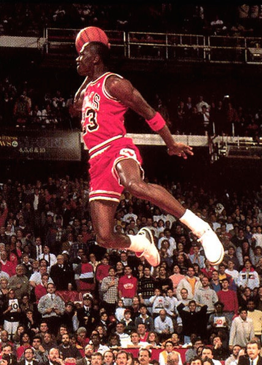
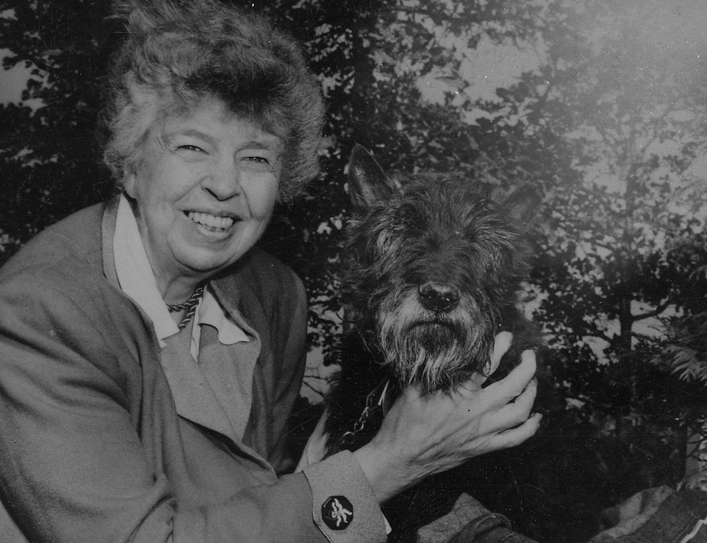

## when you were young,
## what did you want to be  

# when you _grew up_

###   Scott Baldwin
####Chief Happiness Officer

---

---

## [fit] i just want to be
# [fit] _happy_

^ Logan LaPlante
https://www.youtube.com/watch?v=h11u3vtcpaY

---

## answer this:

### what matters most is
### ________________

---

## my answer:

### _what matters most is_

### _what lasts the longest_

---

## [fit] things that matter most 
# [fit] make us happy

---

> [We] are endowed by [our] Creator with certain unalienable Rights ... Life, Liberty and the pursuit of Happiness.
-- Thomas Jefferson

---

# happy people

### treat _people_ like people, not _objects_
### do what they _excel_ at, often
### actively _pursue_ goals
### make _good_ friends

---

# happy people

### actively express _thank_fulness
### live the life _they_ want to live
### don't chase _stuff_
### _give_

^ http://www.inc.com/jeff-haden/7-things-remarkably-happy-people-do-more.html
"Things" only provide momentary bursts of happiness. To be happier, don't chase as many things. Chase a few experiences intead.

---

> Happiness is...
> a by-product of a life well lived.
-- Eleanor Roosevelt

---

# so, are you feeling

#  _well chuffed?_

---

## track _happiness_

### we ditched velocity

---

## team happiness

### Offers: _8.5_
### Transparency: _8.5_
### Mobile: _9_

---

##_positivity_ + _eye contact_ =
### [fit]biobehavioral synchrony

_**When positive emotions are shared and two people make eye contact, they move to the same hidden beat and start to act as one.**_

---

### you and i need

# **3 _positive_ emotions**

### to balance **1** negative

- _flourish_ at 11:1
- languish at 1:1

---

## negativity limits us

- music with negative emotions
- is this face male or female?
- focused only on the task

---

## positivity opens us

- music with positive emotions
- focus included more than the face
- noticed background was rotating too

---

# [fit]do it _now_
## [fit]you can't will yourself
### [fit]locate one of the _levers_ to turn it on

---

# draw yourself in

- What makes me lucky/blessed to be here?
- What's right about my circumstances?
- What aspect of my current circumstances might I view as a gift to be treasured?

---

### _what matters most..._

### _gifts to be treasured_

---

### autonomy, mastery, purpose

# motivate us

^
https://www.youtube.com/watch?v=rrkrvAUbU9Y

---

###  _Autonomy makes us fast_ because we don't have to wait for managers to make decisions

#### culture at spotify

^
Why would we hire someone if we don't trust them!
http://labs.spotify.com/2014/03/27/spotify-engineering-culture-part-1

---

---

## **_happier_**
## people will produce _happier_ products
#### conway's law (adapted)

^ organizations which design systems ... are constrained to produce designs which are copies of the communication structures of these organizations

---

> Happiness is the 
> object and design of our existence.
-- Joseph Smith

^
Shouldn't we say also say: Happiness is the object and design of our software and systems existence.

---

### bit.ly/wmhappy
